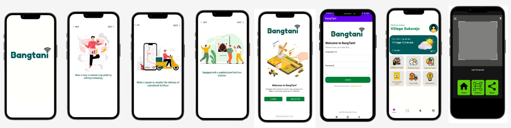

# BangTanI2022

<!-- PROJECT LOGO -->
 

  

 <h3 align="center">BangTanI (BANGKIT TANI Indonesia)  </h3>

  

    Have many feature argiculture in one hands for monitoring argiculture in Indonesia
     
    <a href=""><strong>Explore the docs »</strong></a>
     
     
    <a href="">View Demo</a>
    ·
    <a href="">Report Bug</a>
    ·
    <a href="">Request Feature</a>
  

## About The Project

Indonesia is a country rich in agriculture therefore, as Indonesian citizen they must be able to take care of existing agriculture. however, currently there are still many who cheat on agricultural care in Indonesia, especially in the manufacture of fertilizer. there are so many who commmit fraud in the manufacture of fertilizers. such as mixing fertizers with other ingredients that can damage fertilizers. this a challenge for government in assisting farmer groups in managing agriculture in Indonesia, BangTani is one of the appications to help the goverment and farming in managing existing agriculture, especially in predicting native fertilizers and managing fertilizer supply chain management in Indonesia. 

Use the `BLANK_README.md` to get started.

(<a href="#top">back to top</a>)

<!-- GETTING STARTED -->
## Documentation
Ml  : Model in use in ml model is clasification have 2 class, that is original and fake for modeling to get recomendation fertilizer, while image clasification using TensorFlow for dataset, we using dataset  https://www.kaggle.com/datasets/atharvaingle/crop-recommendation-dataset and for image dataset fertilizer we search it with reference in several image sample via web. 

MD : build ui ux with aplication android studio and leanguage programing kotlin, for appearance we collect from aplication aplication have. for the API we use from the API course my MD learning material in DICODING. because our CC team for API has not been able to create endpoints and still has many problems.

CC: For make api, he using node js, he get trouble to deploy on gcp, and ml model. 

### Prerequisites
1. Android Minimal 5.0 lolipop (SDK 21) or Above
2. Internet Connection
3. Good Connection

How to Using
1. Open The App 
2. you will be see getting starter
3. you can chose Login if have account or you make new account with name button register
4. After that you will see home dashboard
5. you can click feature if you need. 
6. example fertiscanner 
7. you can redirect camera to fertiziler plant for scanning then
8. application will be show suggestion and description 

Contact us
1. Pungky Nabella Saputri - M7007F0648@bangkit.academy
2. Julio Febrian - M2010F1099@bangkit.academy
3. Jordy Kusuma Sanjaya - C2234F2129@bangkit.academy
4. Dewi Putri Ayuningsih - A2007F0653@bangkit.academy
5. Antonio Marco Lukito - C2234F2128@bangkit.academy

